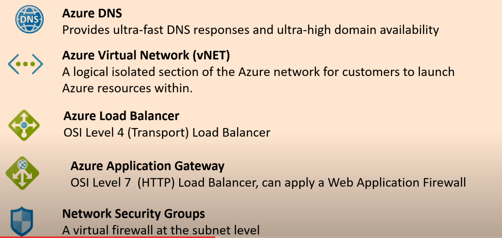
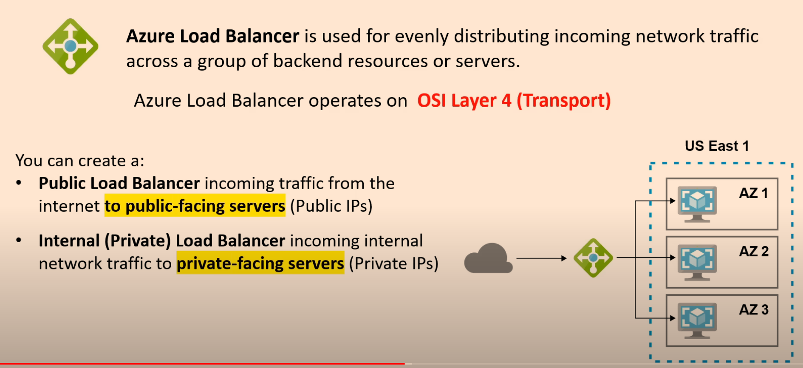
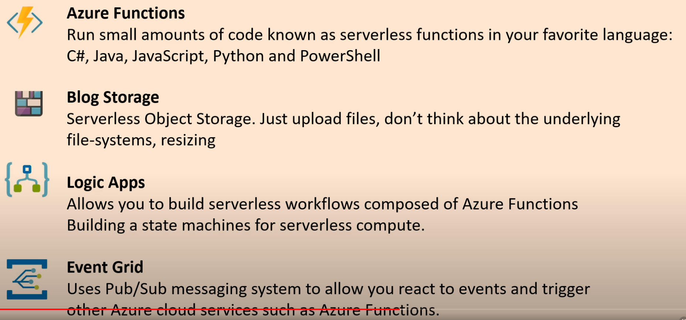

#### What is cloud computing?
The practice of using a network of remote servers hosted on the internet to store, manage, and process data, rather than a local server or a personal computer.

### Evolution of servers/hosting

##### Dedicated server
- One physical machine dedicated to a single business.
- Runs a single web-app/site
- Very expensive, high maintenance, high security

##### Virtual private server
- One physical machine dedicated to a single business.
- The physical machine is virtualized into sub-machines.
- Runs multiple web-apps/sites

##### Shared hosting
- One physical machine, shared by hundreds of businesses
- Relies on most tenants under-utilizing their resources
- Very cheap, very limited

##### Cloud hosting
- Multiple physical machines that act as one system.
- The system is abstracted into multiple cloud services
- Flexible, scalable, secure, cost-effective, high configurability

### Common cloud services

##### Compute
- Imagine having a virtual computer that can run applications, programs and code.

##### Storage
- Imagine having a virtual hard-drive that can store files.

##### Networking
- Imagine having the virtual network being able to define internet connections or network isolations.

##### Databases
- Imagine a virtual database for storing reporting data or a database for a general purpose web-application.

### Benefits of cloud computing

##### Cost-effective
- You pay for what you consume.
- No up-front costs.
- Thousands of customers sharing the cost of the resouces.

##### Global
- Launc workloads anywhere in the world. Just choose a region.

##### Secure
- Cloud provider takes care of physical security.
- Cloud services can be secure by default, or you have the ability to configure access down to granular level. 

##### Reliable
- Data backup, disaster recovery, data replication, fault tolerance

##### Scalable
- Increase or decrease resources and services based on demand

##### Elastic
- Automate scaling during spikes and drop in demand.

##### Current
- The underlying hardware and managed software is patched, upgraded and replaced by the cloud provider without interruptions to you.

### Types of cloud computing

##### Software as a Service (SaaS)
- A product that is run an managed by the service provider.
- Don't worry about how the service is maintained.
- It just works and remains available.
- **For customers**

##### Platform as a Service (Paas)
- Focus on the deployment and management of your apps.
- Don't worry about provisioning, configuring or understanding the hardware or OS.
- **For developers**

##### Infrastructure as a Service (IaaS)
- The basic building blocks for cloud IT
- Provides access to networking features, computers and data storage space.
- Dont't worry about IT staff, data centers and hardware

### Types of cloud computing responsibilities

Types               | on premise | Iaas      | Paas      | SaaS    |
|-------------------| ---------- |-----------|-----------|---------|
| **Applications**  | Customer   | Customer  | Custoemr  | CSP     |
| **Data**          | Customer   | Customer  | Customer  | CSP     |
| **Runtime**       | Customer   | Customer  | CSP       | CSP     |
| **Middleware**    | Customer   | Customer  | CSP       | CSP     |
| **OS**            | Customer   | Customer  | CSP       | CSP     |
| **Virtualization**| Customer   | CSP       | CSP       | CSP     |
| **Servers**       | Customer   | CSP       | CSP       | CSP     |
| **Storage**       | Customer   | CSP       | CSP       | CSP     |
| **Networking**    | Customer   | CSP       | CSP       | CSP     |
CSP: Cloud Service Provider

### Azure's deployment models

##### Public cloud
- Everything built on the cloud provider
- Also known as Cloud Native

##### Private cloud
- Everything built on company's datacenters
- Also known as **on-premise**
- The cloud could be **OpenStack**

##### Hybrid
- Using both on-premise and a cloud service provider
- They are connected together

### Total cost of ownership (TCO)

### Capital vs operational expenditure

##### CAPEX
- Spending money upfront on physical infrastructure and deducting that expense from your tax bill over time
- With capital expenses you have to guess upfront what you plan to spend.
- Normal costs:
  - server costs (computers)
  - storage costs (hard drives)
  - network costs (routers, cables, switches)
  - backup and archive costs
  - disaster recovery costs
  - datacenter costs (rent, cooling, physical security)
  - technical personal

### Operation expenditure (OPEX)
- The costs associated with an on-premise datacenter that has shifted the costs to the service provider. The customer only has to be concerned with non-physical costs. 
- With OPEX you can try a product service without investing in equipment.
- Normal costs
  - Leasing software and customizing features
  - Training employees in cloud services
  - Paying for cloud support
  - Billing based on cloud metrics eg.
    - compute usage
    - storage usage

### Cloud Architecture Terminologies
##### Availability
  - Your ability to ensure a service remains available
  - **High availability (HA)**
    - Your ability for your service to remain available by ensuring there is no single point of failure and/or ensure a certain level of performance.
    - Running your workload across multiple **availability zones** ensures that if 1 or 2 AZs become unavailable your service/application remains available. 
    - Azure Load Balancer
      - A load balancer allows you to evenly distribute traffic to multiple servers or datacenters.
      - If a datacenter or server becomes unavailable (unhealthy) the load balancer will route the traffic to only available datacenters with servers. 

##### Scalability
  - Your ability to grow rapidly or unimpeded
  - Your ability to increase your capacity based on increasing demand of traffic, memory and computing power. 
  - Vertical scaling
    - upgrade to a bigger server
  - Horizontal scaling
    - Adding more servers of the same size
  - High elasticity
    - Your ability to **automatically** increase or decrease your capacity bsed on the current demand of traffic, memory and computing power. 
    - Normally we would use horizontal scaling to deal with elasticity. 
    - To secure high elasticity on Azure we would use **`Azure VM Scale Sets`** to automatically increase or decrease in response to demand or a defined schedule. 
    - We can use **`SQL Server Stretch Database`** to dynamically stretch warm and cold transactional data from Microsoft SQL Server 2016 to Microsoft Azure.

##### Fault tolerance
  - Your ability to prevent a failure

##### Disaster recovery (DR)
    - Your ability to recover from a failure
    - **High durability (DR)**

### The evolution of computing

##### Dedicated

#### Virtual Machine

#### Containers

#### Functions

### Regions and geographies
- A region is a grouping of multiple datacenters (availability zones)
  - Azure has 58 regions available across 140 countries
  - Each region is paired with another region 300 miles away
    - Only one region is updated at a time to ensure no outages
    - Some Azure Services rely on paired regions for **disaster recovery**
      - Eg. **`Azure Geo-redundant Storage (GRS)`** replicates data to a secondary region automatically, ensuring that data is durable even in the event that the primary region isn't recoverable. 
- A geography is a descreet market of two or more regions that preserves **`data residency`** and **`compliance boundaries`** 
  

### Azure computing services

### Azure storage services

### Azure database services

### Azure integration services

### Azure developer and mobile tools

### Azure devops tools

### Azure resource management

### Azure quickstart templates

### Azure virtual network (vNet) and subnets

### Azure virtual network (vNet) and subnets

### Azure enterprise hybrid networking services

### Azure traffic manager

### Azure DNS

### Azure load balancer

### Scale sets

### Azure IOT services

### Azure big data and analytics

### Azure machine learning and AI

### Azure serverless services

### Azure portal

### Azure preview portal

### Azure powershell

### Azure cloud shell

### Azure CLI

### Resource groups
- This is probably important...get more info
- Define a resource group
- Learn to create a resource group

### virtual network (vNet)
- define vNet
- learn how to create a virtual network

### Virtual machine
- Learn how to create a virtual machine

### Function app (serverless functions)
- Learn how to set one up

### Storage account

### Azure security

### Azure security

### Azure Multi-factor authentication

### Azure security center

### Azure key vault

