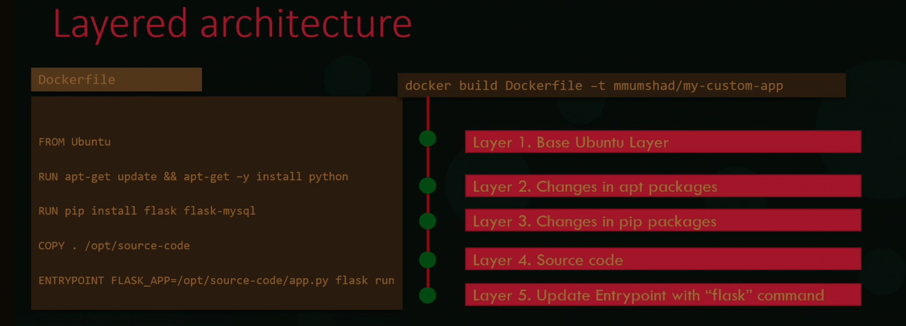

<sub></sub>   
<sub><span style="color:orange"></span></sub>

##### Login to docker hub
- `docker login -u [username] -p [password]` ==> login to dockerhub
- `docker login -u [username]` ==> then supply access token
- `docker login` ==> login to dockerhub
  - Will be prompted username and password

#### Check if docker is running
- `systemctl status docker` ==> check if docker is running

##### Get list of docker containers
- `docker ps` will return a list of all running containers
- `docker ps -a` ==> show list of all containers
  - `-a` stands for all

##### Get list of docker images
- `docker images` ==> get list of images
- `docker image ls` ==> return list of all docker images
- `docker image ls -q` ==> return list of docker image ids
- `docker image history [image id]` 
  - <sub><span style="color:orange">We only need to include enough of the **image id** to make it unique so docker will find the correct one</span></sub>

##### Inspect container
- `docker inspect [container id]` | `docker inspect [container name]`
  - returns container data in json format

##### build image 
- `docker build -t [image-name]:[tag] .`  (remember the `.` at the end)
- If we update our project code we then create a new image with the same name but with an updated tag
  - `docker build -t [image-name]:[updated tag] .` 
- Why do I care how many layers I have?
  - More layers mean a larger image. The larger the image, the longer it takes to build, and push and pull from a registry.Smaller images mean faster builds and deploys, but also results in a <span style="color:orange">smaller attack surface</span></sub>.
- How can I reduce my layers?
  - use shared base images wherever possible
  - Limit the data written to the container layer
  - Chain RUN statements
  - Prevent chache misses at build for as long as possible. 
- Cache
  - Starting from the parent instruction, Docker will look at each following instruction to see if it matches the cached version.
  - only `ADD` and `COPY` will look at checksums for a match
  - other than ADD and COPY, only the string of the command is used, not the contents of the files.
  - Once cache is broken, every subsequent layer is built again. 
<br>


##### Remove image
- `docker rmi [image-id]`
  - <sub>`rmi` is used for images while `rm` is used for containers.</sub>
<br>


##### Remove all images
- `docker container rm -f $(docker container ls -a -q)`
  - we can combine flags `docker container rm $(docker container ls -aq)`
  - `-f` stands for force
- `docker image rm $(docker image ls -q)`
<br>


##### run container
`docker run --name [container name] -p [port on computer]:[port on container] [image-name]:[tag]`
  - `docker run --name first-container -p 8080:8080 fastapi-app:1.0.0` 
      - `-p` ==> port 
      - `-d` ==> detached mode ==> runs the container in the background
        - <sub>`docker attach [container id]` ==> shift the container to attached mode</sub>
      - `-i` ==> interactive mode
      - `-t` ==> terminal
      - `-v` ==> volume mapping for persisting data
        - `docker run -v [data-folder-in-project]:[data-folder-in-container] mysql`
          - The data will be stored in a project folder even if the container is deleted.
          - This is called bind mounting
        - `docker run -v [docker-volume]:[data-folder-in-container] mysql`
          - The data will be stored in a docker volume folder
          - This is called volume mounting
      - `--mount`
        - `docker run --mount type=[mount type], source=[source], target=[target] mysql` 
        - `docker run --mount type=bind, source=/data/mysql, target=/var/lib/mysql mysql` 
        - storage drivers (docker will choose the best one depending on the OS)
          - AUFS
          - ZFS
          - Device Mapper
          - Overlay
          - Overlay2
      - `-e` ==> set environment variable
      - `--network` ==> select network to use
        - network types:
          - bridge
            - private internal network created by Docker on the host.
          - none
          - host
          - user-defined network
            - `docker network create --driver bridge --subnet 182.18.0.0./16 custom-isolated-network`
        - 
<br>


##### run container from the cloud
- `docker run -d --hostname my-rabbit --name some-rabbit -p 8080:15672 rabbitmq:3-management`
  - docker will download image to computer and then run it
<br>

##### download image from docker-hub
- `docker pull [image-name]:[tag]`
<br>


##### Stop container
- `docker stop [container id]`
<br>


##### Remove container
- `docker rm [container id]` | `docker rm [container name]`
  - `--force` ==> force removal of running container
<br>

##### Container logs
- `docker logs [container id]` | `docker logs [container name]`


##### Inspect container
- `docker inspect [container name]` | `docker inspect [container id]`

#### Dockerfile
- **CMD VS Entrypoint**
  - CMD
    ```dockerfile
    CMD [command] [param]
    CMD sleep 5
    # or
    CMD ["command", "param"]
    CMD ["sleep", "5"]
    ```
  - Entrypoint
    ```dockerfile
    ENTRYPOINT ["sleep"]
    ```
    In command line: `docker run [docker-name] 10` ==> container will sleep for 10 sec
    <br>
    To use a default argument, write the dockerfile like this:
    ```dockerfile
    ENTRYPOINT ["sleep"]
    CMD 5
    ```
    <br>
    We can also override the entrypoint argument by writing:
    `docker run --entrypoint sleep2.0 ubuntu-sleeper 15`


##### Docker compose
- A higher-abstraction tool that:
  - handles multiple containers at a time
  - uses YAML to define an application stack
  - makes spinning up dev environments a piece of cake
  - is an open specification
- Common commands:
  - `docker-compose up` ==> spin up all of the services
  - `docker-compose up --build` ==> rebuild image and spin up all of the services
  - `docker-compose down` ==> tear it all down
  - `docker-compose logs` ==> view all logs in a single stream


##### Multi-stage
- Use cases:
  - Separate build from runtime environment (shrinking image size)
  - Slight variations on images (DRY)
  - Build/dev/test/lint... specific environments
  - Delinearizing your dependencies (concurrency)
  - Platform-specific stages


##### Best practices:
- Use `docker compose` to replace run commands you're using over and over.
- Don't build a container every time you make a change. Where possible, mount source code into a dev container that responds to file changes.
- The Twelve-Factor methodology specifies configuration should be stored in the environment around an application. 
- Use specific image versions
- Order Dockerfile commands from least to most frequently changing in order to take advantage of caching. The reason for this is that when one step in the Dockerfile is executed, the steps that follow are also executed and not taken from the cache. 
- Use a `.dockerignore` file to reduce image bloat. 

#### Dockerfile examples
