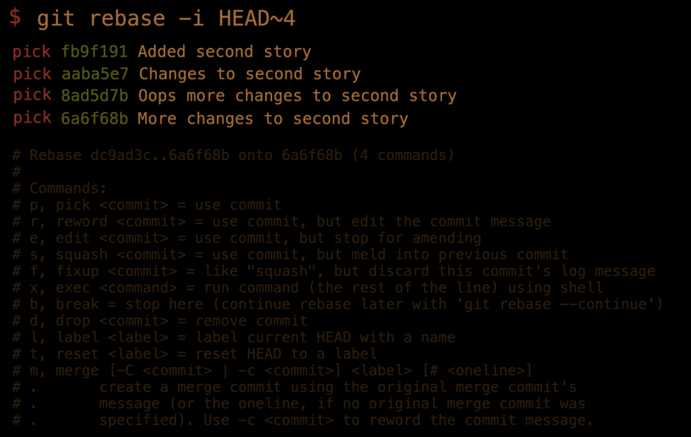
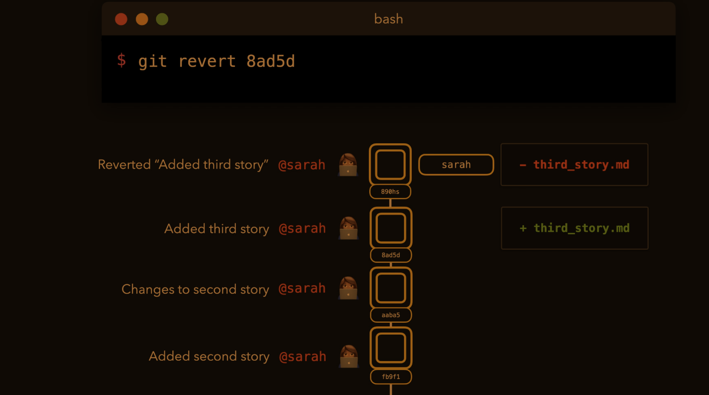

video: 1.37

##### Three areas
- Working area
- Staging area
- Committed files

##### Process
- `git init` ==> initialize repository
- Create file and write some text to it
  - `touch main.py`
  - `echo "this is the main python file" >> main.py`
  - This file is now in the git **working area**
- `git status`
- `git add main.py` ==> add file to the **staging area**
- `git commit -m "added main.py"` ==> main.py is now **comitted**

##### Commit
- `git commit -m [msg]` ==> commit
- `git commit --amend` ==> change message of last commit
- `git commit --ament --no-edit` ==> add new files to staging but don't update the message

##### Fetch + Pull
- `git fetch origin main` ==> download latest update of master branch
- `git merge origin/main` ==> update the master branch on our local repo
- `git pull origin main` ==> combines the two commands above

##### Push
- `git push -u [remote-repo] [branch-name]`
- `git push origin --delete [branch]` ==> delete branch on a remote

##### Branches
- A branch is a pointer to a certain commit
- `git branch sarah` ==> create new branch called sarah
- `git checkout sarah` ==> switch to existing branch named sarah
- `git checkout -b sarah` ==> create and switch to a new branch "sarah"
- `git branch` ==> get list of branches
- `git branch -d sarah` ==> delete the branch named sarah
- `git branch --list` ==> view all branches
- `git branch -r` ==> view remote branches
- `git branch -a` ==> view all branches
- `git switch [branch-name]` ==> switch to branch
- `git checkout -c [branch-name]` =>> create and checkout a branch
- `git branch --merged` ==> see which branches have been merged

##### Merge branches
- Two types of merges
  - fast-forward merge
    - when the current branch has no extra commits compared to the branch we are merging
  - no-fast-forward merge

- `git checkout master`
- `git merge feature/signup`
- `git merge --no-ff [branch-to-merge]` ==> no fast forward merge. The merge is created as a commit.
- three-way merge

##### Rebasing
- `git rebase master` ==> move our branch on top of the updated master branch
  - When we do this we modify the history of our git commits
- Interactive rebasing
  - Used when several commits should ideally just have been one commit
    - fix typo 1
    - fix typo 2
    - fix typo 3
      - ==> one commit for fixing all typos
  - `git rebase -i HEAD~4` ==> replace last four commits with one commit

##### Remote
- `git remoe show origim`
- `git remote -v` ==> list all remote repositories
- `git remote add origin <connection-string>` ==> add remote connection string
- `git push origin <branch_name>`
  - `git push origin master`
- `git clone <shh_link>` ==> download a project to the computer
  - `git clone git@github.com:<account>/<remote-repo>.git`

##### Pull requests
- We do this at the GitHub website

##### Cherry picking
- `git cherry-pick <hash>` ==> copy a specific commit of a branch into the master branch

#### Revert

#### Reset
- `git reset` ==> remove all staged content
- `git reset --hard` ==> removes the staged content and actually reverts the file(s) itself back to the previous commit.
- `git reset --soft HEAD~1` ==> removes the last commit
  - by using the soft reset we still have access to the changes made
  - this can be seen by writing `git status`
- `git reset --hard HEAD~1` ==> removes the last commit
  - by using hard reset we also lose the changes we have made
- `git reset --hard <hash>` ==> revert a certain change
- `git reset [first x chars of commit] --soft`

##### Restore
- `git restore --staged [file]` ==> restore version in staged (from last commit HEAD) but NOT from working.
- `git restore [file]` ==> restore working directory from staged

##### Stashing
- `git stash` ==> stash something
- `git stash pop` ==> retrieve from stash back into the staging area
- `git stash list` ==> list of all stashes

##### Tags
- git tag [tag] [commit]
  - if `commit hash` is not specified, the tag will be applied to the last commit.
- git tag [tag] HEAD~2 ==> give tag to commit two versions back.
- `git tag -a [tag] [commit] -m "some message"`
- `git show [tag]`
- `git push --tag`
#### Reflog
- `git reflog` ==> list of all changes

##### rm
- `git rm [file]` ==> stage the removal of a committed file (which will also delete from working). Will have to be comitted for the change to take place.
- `git rm --cached [file]` ==>

##### Log
- `git log` ==> show a log of commits
- `git log --oneline` ==> git log "barebones"
- `git log --graph --decorate`
- `git log --oneline --graph --decorate --all`

##### Diff
- `git diff --cached` ==> difference between what is staged and what is currently commited
- `git diff [commit_old]..[commit_new]`
- `git diff HEAD` ==> sum of `git diff` and `git diff --cached`
- `git diff [branch] [other branch]`
##### Config
- `git config --global init.defaultBranch main` ==> set default branch to name "main"

#### cat-file
- `git cat-file -t [hash]` ==> see type of hash
- `git cat-file -p [hash]` ==> see content of hash