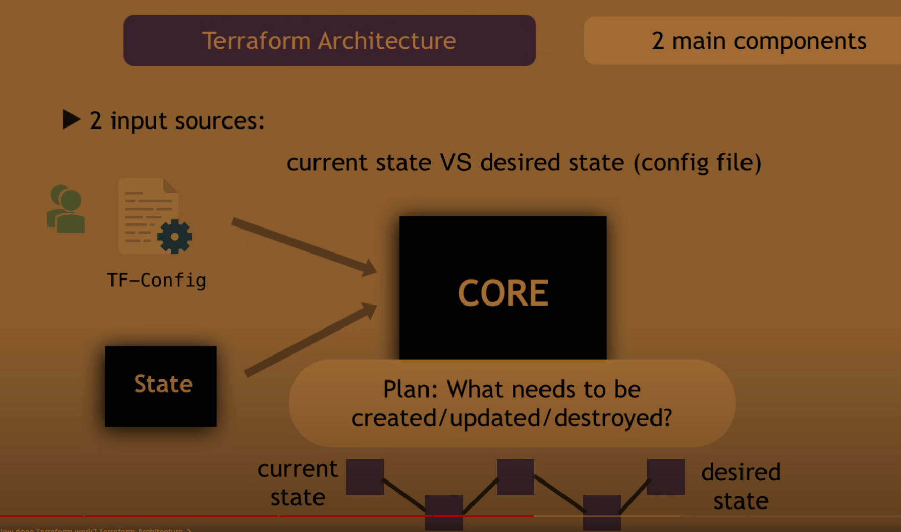
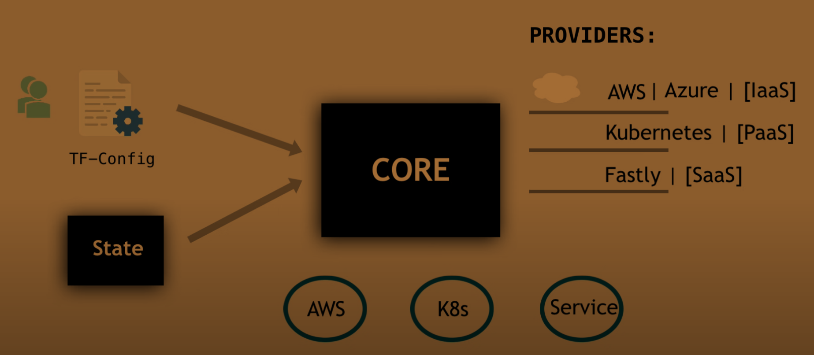
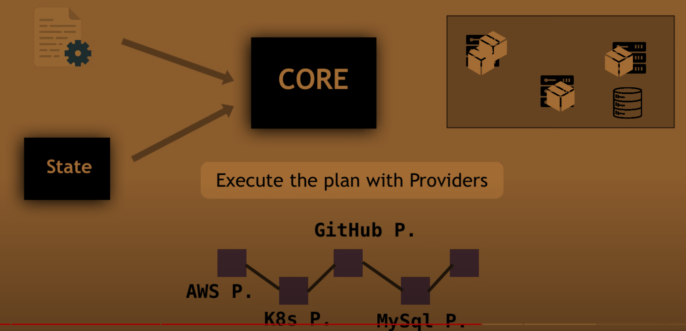
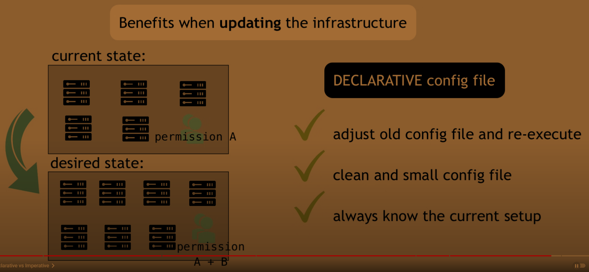
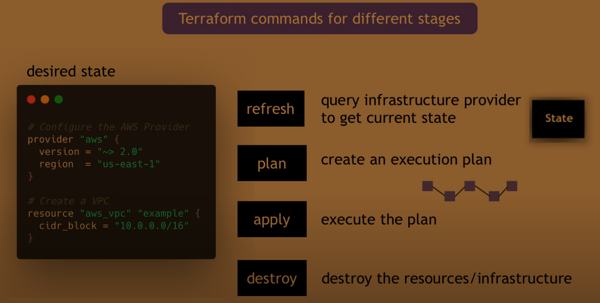

#### What is Terraform?
- An `infrastructure as code` tool
- Automate and manage your:
  - infrastructure
  - platform
  - services that run on that platform

#### Other infrastructure as code tools
- Ansible
- Chef
- AWS CloudFormation

#### How does Terraform work?

#### Terraform with azure
- `az login` ==> login to azure
- `az account show` ==> show account details
- `terraform fmt` ==> formats code
- `terraform init` ==> initializes the terraform backend
- `terraform apply -auto-approve` ==> apply without getting asked to confirm
- `terraform state list` ==> show list of the resources we have
- `terraform state show <resource>` ==> show specific resource state
- `terraform show` ==> show all of the state
- `terraform apply -destroy` or `terraform destroy` ==> destroy resources