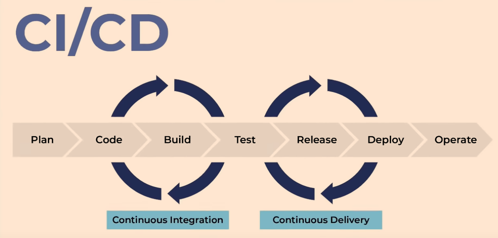

#### What is devops?
- DevOps is the union of people, process, and products to enable continuous delivery of value to our end users.

#### Agile manifesto:
- https://agilemanifesto.org/

![img][def]

[def]: images/infrastructure_as_code_tools.PNG